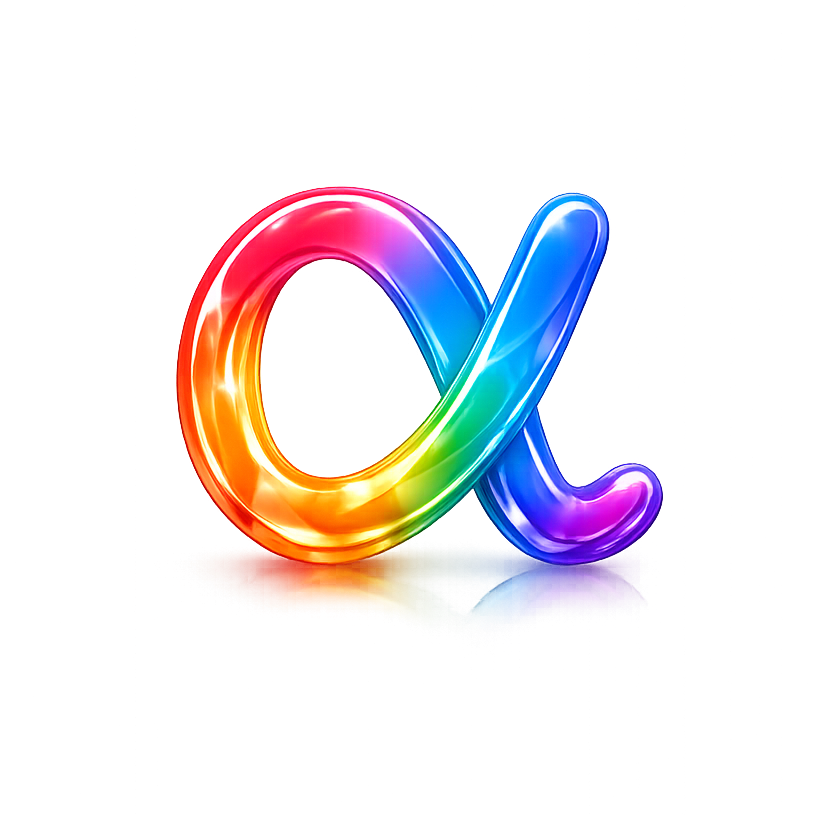

<div align="center">



# atelier

**The free, open-source GTA-V addon-clothing tool.**

Manage clothing, preview it in real-time 3D, and build it in one click for
**FiveM · Singleplayer · RageMP · alt:V**.

[](LICENSE.md)
&nbsp;
&nbsp;

[**⬇ Download**](https://github.com/feelgoodrp-com/atelier/releases) ·
[Backend](https://github.com/feelgoodrp-com/atelier-api) ·
[In-game viewer](https://github.com/feelgoodrp-com/atelier-fivem) ·
[In the spirit of grzyClothTool](https://github.com/grzybeek/grzyClothTool)

</div>

---

## What is atelier?

atelier is a Windows desktop app for building, validating and publishing GTA-V
addon clothing **and tattoos** — built from scratch in the spirit of
grzyClothTool. You manage drawables in a workbench, author tattoos in a dedicated
area, review everything in real-time 3D, and build an in-game-ready addon in one
click. It runs **fully standalone** — no account or backend needed — and you can
optionally collaborate as a team over a cloud.

## Features

- **Solo mode** — fully local: build, preview and export with **no account, no
  backend, completely offline**. Sign in only if you want the team cloud.
- **Real-time 3D preview** — multiple drawables at once, camera presets
  (head/torso/legs/feet), animation poses, hair-shrink & heel-height live,
  optionally on the real ped body. Textures and ped props included.
- **Workbench** — category tree (12 component + 6 prop slots with warning
  badges), searchable drawable list (reorder, multi-select), inspector and
  texture panel (a–z) with duplicate detection.
- **Tattoo authoring** _(new in 1.2)_ — a dedicated **Tattoos** area: import decals
  (PNG/DDS/YTD), set zone, gender, type and draw order, then build a streamable
  FiveM tattoo pack — YTD + `<PedDecorationCollection>` overlay + optional
  `shop_tattoo.meta` + a `tattoos.json` runtime manifest for the server.
- **Build** — real binary `CPedVariationInfo` YMTs via CodeWalker for **FiveM**,
  **Singleplayer**, **RageMP** and **alt:V**; automatic 128-split, shop metas
  and `fxmanifest.lua`.
- **Texture optimization** — BC1/BC3/BC7 re-encode, downscale & mips, individually
  or as a batch across all oversized textures.
- **In-game viewer** _(optional)_ — tick **Viewer metadata** when building for
  FiveM and the pack also gets an `atelier-pack.json`, so
  [atelier-fivem](https://github.com/feelgoodrp-com/atelier-fivem) can find it on
  your server and let you browse it on a ped — with the labels and groups you
  gave your items, instead of bare index numbers. Off by default; without the
  tick the build output is unchanged and the pack stays invisible to the viewer.
- **Team cloud** _(optional)_ — push/pull against versioned pack revisions, live
  presence and advisory locks (via [atelier-api](https://github.com/feelgoodrp-com/atelier-api)).
- **Import wizard** — existing packs as well as `.ydd`/`.ytd`/`.yld` via drag &
  drop, with automatic classification.

## Installation

Grab the latest version from the
[**GitHub releases**](https://github.com/feelgoodrp-com/atelier/releases):

| Variant | File | When |
| --- | --- | --- |
| Installer | `atelier-*-setup.exe` | the default |
| MSI | `atelier-*.msi` | managed environments |
| Portable | `atelier-*-portable.zip` | unzip & run (app + sidecar included) |

On first launch a short wizard lets you pick a mode — **solo** (fully local, no
account) or **team** (cloud) — then the GTA-V path and logs (plus the server
address in team mode).

## Build from source

Requirements: [Bun](https://bun.sh), Rust (stable) and the .NET 8 SDK
(details in [`sidecar/README.md`](sidecar/README.md)).

```powershell
bun install
bun run tauri dev        # starts the app and spawns the .NET sidecar automatically
```

Useful scripts:

```powershell
bun run build             # frontend typecheck + Vite build
bun run selftest:project  # project-format / sync self-test
bun run sidecar:publish   # builds the sidecar (src-tauri/binaries/…)
bun run tauri:build       # release bundle (installer + portable)
```

> `src-tauri/binaries/` is gitignored. On a fresh checkout either run
> `bun run sidecar:publish` or create a 0-byte placeholder
> `fg-atelier-sidecar-x86_64-pc-windows-msvc.exe` so that
> `tauri dev`/`tauri build` stay green.

## Architecture

```
┌────────────────────────────┐  spawn   ┌──────────────────────────────┐
│  atelier (desktop app)     │ ───────► │  fg-atelier-sidecar (.NET 8) │
│  Tauri 2 · React 19 · TS   │ ◄─────── │  CodeWalker.Core — YDD/YTD    │
│                            │  stdout  │  parsing, 3D GLB, YMT build   │
└──────────────┬─────────────┘          └──────────────────────────────┘
               │ HTTPS (optional, for teams)
               ▼
        ┌────────────────────┐
        │  atelier-api (Bun) │  Discord login, cloud sync, storage
        └────────────────────┘
```

- **App** — Tauri 2 (Rust) + React 19 + Vite + Tailwind (dark-only:
  `#0b0b0b`, blurple `#5865F2`, Sora).
- **Sidecar** — .NET 8 minimal API, spawned locally by the app; uses
  CodeWalker.Core for parsing, the 3D preview and real binary YMTs.
- **API** _(optional)_ — [atelier-api](https://github.com/feelgoodrp-com/atelier-api),
  only needed for login & the team cloud.

## License

atelier is released under the **[PolyForm Noncommercial License 1.0.0](LICENSE.md)**.

✅ You may **use, modify, share and create forks/your own builds** — for
**noncommercial** purposes (hobby, community, learning).
🚫 **Selling and commercial use are not permitted.**
Keep the copyright line (`Required Notice` in the license) intact.

### Third-party components

- **CodeWalker.Core** ([dexyfex](https://github.com/dexyfex/CodeWalker)) — linked
  as a library in the sidecar (vendored under
  `sidecar/third_party/CodeWalker.Core/`, unmodified), under the original
  project's license.
- **grzyClothTool** ([grzybeek](https://github.com/grzybeek/grzyClothTool)) —
  **GPL-3.0**, used solely as a *reference & inspiration*. **No code is copied
  or linked.**
- Tauri, React, three.js and other dependencies under their respective licenses.

## Credits

- **[dexyfex](https://github.com/dexyfex/CodeWalker)** — CodeWalker, the heart of
  the 3D preview and the YMT pipeline. ❤️
- **[grzybeek](https://github.com/grzybeek/grzyClothTool)** — grzyClothTool, the
  inspiration and blueprint.
- **[gitBitsystem](https://github.com/gitbitsystem)**
  ([Discord](https://discord.gg/blpd)) — community contributor: image-to-texture
  import, the RGBA8888 format and dialog fixes.
- **[Blaccii](https://github.com/Blaccii)** — community contributor: the
  256-drawable split limit.
- Built by the **feelgood team** and **Claude Fable 5(RIP)**.
